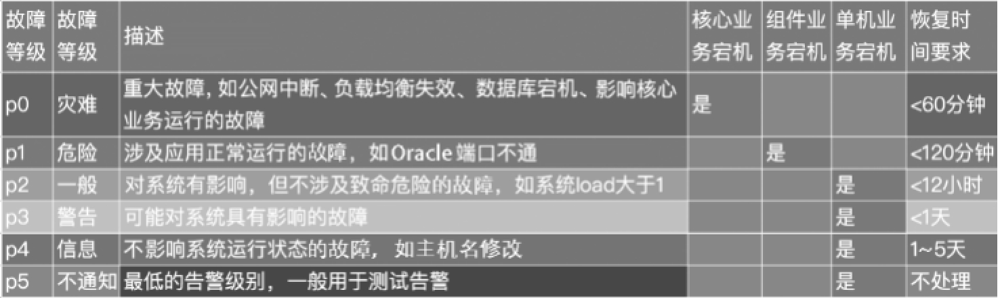

> 《Zabbix企业级分布式监控系统第2版》随书代码
>
> 代码仓库地址 https://github.com/zabbix-book/zabbix_v2
>
> 书籍购买地址 https://item.jd.com/12653708.html

# 187页




# 194-196页

```powershell
4．Trigger表达式示例
示例1：对主机www.zabbix.com的CPU负载值进行判断。

{www.zabbix.com:system.cpu.load[all,avg1].last(0)}>5
{www.zabbix.com:system.cpu.load[all,avg1]给出了监控参数的名称。指定服务器是www.zabbix.com，Item是system.cpu.load[all,avg1]，使用函数last()取最近一次获取到的值，>5表示来自www.zabbix.com主机的最后负载值大于5时触发器进入PROBLEM状态。
示例2：对主机www.zabbix.com的CPU负载值进行多重条件判断[叙述对吗？]。

{www.zabbix.com:system.cpu.load[all,avg1].last()}>5 or{www.zabbix.com:system.cpu.load[all,avg1].min(10m)}>2 
当负载值大于5或者最近10分钟内的负载值大于2时，就会触发Trigger进入PROBLEM状态。
示例3：对文件/etc/passwd是否有变化进行监控。
使用函数diff：

{www.zabbix.com:vfs.file.cksum[/etc/passwd].diff()}=1
当文件/etc/passwd之前的checksum值与最近的值不同时，则会触发Trigger进入PROBLEM状态。
示例4：对网卡流量是否超过一定阈值进行条件判断。
使用函数min：

{www.zabbix.com:net.if.in[eth0,bytes].min(5m)}>100K
当最近5分钟内eth0接收到的字节数大于100KB时，则会触发Trigger进入PROBLEM状态。
示例5：两台SMTP服务器的集群节点都停止了。
注意，在一个表达式中使用两个不同的主机，语句如下：

{smtp1.zabbix.com:net.tcp.service[smtp].last()}=0 and {smtp2.zabbix.com: net.tcp.service[smtp].last()}=0
当SMTP服务器smtp1.zabbix.com与smtp2.zabbix.com都停止时，表达式为真，则会触发Trigger进入PROBLEM状态。
这个示例讲的也就是告警关联，对于避免误报具有很好的效果。
示例6：对Zabbix客户端代理版本是否满足特定版本进行判断。
使用函数str()：

{zabbix.zabbix.com:agent.version.str("beta8")}=1
当Zabbix客户端代理有版本beta8时，该表达式为真。
示例7：服务器的imcp ping不可达进度判断。

{zabbix.com:icmpping.count(30m,0)}>5
主机zabbix.zabbix.com在最近30分钟内超过5次不可达，该表达式为真。
示例8：服务器最近3分钟内没有响应。
使用函数nodata()：

{zabbix.com:tick.nodata(3m)}=1
tick必须使用“Zabbix trapper”类型。为了使这个触发器能工作，tick必须定义。该主机应该使用Zabbix-Sender定期为该参数发送数据。如果180s都没有接收到数据，该触发器的状态就变为PROBLEM。
示例9：对CPU在特定时间的负载判断。
使用函数time()：

{zabbix:system.cpu.load[all,avg1].min(5m)}>2 and {zabbix:system.cpu.load [all,avg1].time(0)}>000000 and {zabbix:system.cpu.load[all,avg1].time()}<060000
触发器只在晚上（00:00—06:00）可用，当5分钟内的负载值大于2时，该触发器的状态就变为PROBLEM。
示例10：检查客户端本地时间是否与Zabbix-Server服务器时间同步。
使用函数fuzzytime()：

{MySQL_DB:system.localtime.fuzzytime(10)}=0
当MySQL_DB的本地时间与Zabbix-Server的时间相差超过10s时，触发器变为PROBLEM状态。
示例11：CPU的负载在最近1小时的平均值，与一天前的值进行同比大于2倍。[请顺一下这句话]

{server:system.cpu.load.avg(1h)}/{server:system.cpu.load.avg(1h,1d)}>2
示例12：存储容量小于总容量的10%。

{Template PfSense:hrStorageFree[{#SNMPVALUE}].last()}<{Template PfSense: hrStorageSize[{#SNMPVALUE}].last()}*0.1 #乘号的优先级比小于号大
示例13：进程数是总进程数的80%。

({Template_Oracle:oracle[procnum].last(0)}*100/{Template_Oracle:oracle[maxprocs].last(0)})>80
示例14：判断告警故障表达式，满足阈值的个数大于或等于2。即满足告警条件{Zabbix server:system.cpu.load [percpu,avg1].last()}>5后，数值1，一共有3个逻辑表达式，故大于或等于2为满足条件，[不通顺]如图6-8所示。

({Zabbix server:system.cpu.load[percpu,avg1].last()}>5) + ({Zabbix server: system.cpu.load[percpu,avg1].last()}>5) + ({Zabbix server:system.cpu.load [percpu,avg1].last()}>5)>=2
```


# 197页

表6-4　Trigger表达式

| 表　达　式                                                   | 解　　释                                                   |
| ------------------------------------------------------------ | ---------------------------------------------------------- |
| {Template OS Linux:agent.hostname.diff(0)}>0                 | 主机名发生了改变                                           |
| {Template OS Linux:kernel.maxproc.last(0)}<512               | 最后接收到的数据小于512个                                  |
| {Template OS Linux:proc.num[,,run].avg(5m)}>30               | 5分钟的平均数值大于30                                      |
| {Template OS Linux:socket.tcp_established.last(0)}>25000 and {Template OS Linux:socket.tcp_established.last(#1,5m)}>25000 | 值大于25000 个并且 5分钟第一次的值大于25000个              |
| {Template OS Linux:system.localtime.fuzzytime(5m)}=0         | 时间相差5分钟                                              |
| {Template OS Linux:agent.ping.nodata(10m)}=1 and  {Template OS Linux:agent.ping.last(#20,10m)}=1 and  {Template OS Linux:agent.ping.last(#16,10m)}=1 and  {Template OS Linux:agent.ping.last(#12,10m)}=1 | 10分钟内没接收到数据，并发10分钟的第12、16、20次都没有数据 |
| {Template Cisco envmon:sysUpTime.change(0)}<0                | 启动时间最近一次的值-上一次的值之差小于0                   |
| {Template SNMP OS ESXi:vmwVMGuestState.[{#SNMPINDEX}]. regexp("not running")}=1 | 匹配字符串“not running”                                    |
| {Template SNMP OS ESXi:hrStorageUsedBlocks[{#SNMPINDEX}]. last(0)} /{Template SNMP OS ESXi:hrStorageSizeBlocks[{#SNMPINDEX}]. last(0)} > 0.9 | 两个值相除大于0.9                                          |


# 205-208页

```powershell
示例1：在默认的标题{TRIGGER.NAME}中表示Trigger的名称。

{TRIGGER.NAME}: {TRIGGER.STATUS}
当接收到消息后，内容将被解析为：

Processor load is too high on server zabbix.zabbix.com: PROBLEM
示例2：除使用宏外，我们还可以使用函数表达式来获取具体的数值[不通顺]。例如：

Processor load is: {zabbix.zabbix.com:system.cpu.load[,avg1].last()}
当接收到消息后，内容将被解析为：

Processor load is: 1.45
示例3：有如下告警消息内容。

Latest value: {{HOST.HOST}:{ITEM.KEY}.last()}
MAX for 15 minutes: {{HOST.HOST}:{ITEM.KEY}.max(900)}
MIN for 15 minutes: {{HOST.HOST}:{ITEM.KEY}.min(900)}
当接收到消息后，内容将被解析为：

Latest value: 1.45
MAX for 15 minutes: 2.33
MIN for 15 minutes: 1.01
示例4：支持在消息内容中显示触发器的正则表达式。

Trigger: {TRIGGER.NAME}
Trigger expression: {TRIGGER.EXPRESSION}
 
1. Item value on {HOST.NAME1}: {ITEM.VALUE1} ({ITEM.NAME1})
2. Item value on {HOST.NAME2}: {ITEM.VALUE2} ({ITEM.NAME2})
当接收到消息后，内容将被解析为：

Trigger: Processor load is too high on a local host
Trigger expression: {Myhost:system.cpu.load[percpu,avg1].last(0)}>5 | {Myotherhost:system.cpu.load[percpu,avg1].last(0)}>5

1. Item value on Myhost: 0.83 (Processor load (1 min average per core))
2. Item value on Myotherhost: 5.125 (Processor load (1 min average per core))
示例5：告警故障消息。

Problem:
Event ID: {EVENT.ID}
Event value: {EVENT.VALUE} 
Event status: {EVENT.STATUS} 
Event time: {EVENT.TIME}
Event date: {EVENT.DATE}
Event age: {EVENT.AGE}
Event acknowledgement: {EVENT.ACK.STATUS} 
Event acknowledgement history: {EVENT.ACK.HISTORY}
当接收到消息后，内容将被解析为：

Problem:
Event ID: 21874
Event value: 1 
Event status: PROBLEM 
Event time: 13:04:30
Event date: 2014.01.02
Event age: 5m
Event acknowledgement: Yes 
Event acknowledgement history: 2014.01.02 11:11:01 "Smith (Admin)"
示例6：告警恢复消息。

Recovery: 
Event ID: {EVENT.RECOVERY.ID}
Event value: {EVENT.RECOVERY.VALUE} 
Event status: {EVENT.RECOVERY.STATUS} 
Event time: {EVENT.RECOVERY.TIME}
Event date: {EVENT.RECOVERY.DATE}
当接收到消息后，内容将被解析为：

Recovery: 
Event ID: 21896
Event value: 0 
Event status: OK 
Event time: 13:10:07
Event date: 2014.01.02
6.3.5　在告警消息中使用宏
在告警消息中同样可以使用宏。下面我们针对Zabbix 4.0版本列出了一些宏，其中较常用的宏已用粗体字标出。

{host:key.func(param)}
{TRIGGER.EVENTS.ACK}
{TRIGGER.EVENTS.PROBLEM.ACK}
{TRIGGER.EVENTS.PROBLEM.UNACK}
{TRIGGER.EVENTS.UNACK}
{TRIGGER.HOSTGROUP.NAME}
{TRIGGER.PROBLEM.EVENTS.PROBLEM.ACK}
{TRIGGER.PROBLEM.EVENTS.PROBLEM.UNACK}
{TRIGGER.EXPRESSION}
{TRIGGER.EXPRESSION.RECOVERY}
{TRIGGER.ID}
{TRIGGER.NAME} 
{TRIGGER.VALUE}
{TRIGGER.NAME.ORIG}
{TRIGGER.NSEVERITY}
{TRIGGER.SEVERITY}
{TRIGGER.STATE}
{TRIGGER.STATUS}
{TRIGGER.TEMPLATE.NAME}
{TRIGGER.URL}

{EVENT.ID}
{EVENT.DATE} #事件的日期
{EVENT.TIME} #事件的时间
{EVENT.UPDATE.HISTORY}
{EVENT.ACK.STATUS}
{EVENT.AGE}
{EVENT.VALUE}
{EVENT.TAGS}  #tag
{EVENT.UPDATE.ACTION}
{EVENT.UPDATE.DATE}
{EVENT.UPDATE.HISTORY}
{EVENT.UPDATE.MESSAGE}
{EVENT.UPDATE.TIME}
{EVENT.RECOVERY.DATE}
{EVENT.RECOVERY.TIME}
{EVENT.RECOVERY.TAGS}
{EVENT.RECOVERY.VALUE}
{TIME}  #发送告警的时间
{DATE}  #发送告警的日期
{PROXY.NAME}
{PROXY.DESCRIPTION}
{ITEM.NAME.ORIG}
{ITEM.LOG.TIME}
{ITEM.LOG.SOURCE}
{ITEM.LOG.SEVERITY}
{ITEM.LOG.NSEVERITY}
{ITEM.LOG.EVENTID}
{ITEM.LOG.DATE}
{ITEM.LOG.AGE}
{ITEM.LASTVALUE}
{ITEM.KEY.ORIG}
{ITEM.NAME}   #Item的名称
{ITEM.KEY}    #Item的key
{ITEM.VALUE}  #Item的值
{ITEM.ID}
{ITEM.DESCRIPTION}
{INVENTORY.*}
{HOST.NAME}  #主机名
{HOST.PORT}
{ACTION.ID}
{ACTION.NAME}
```


# 213页

```shell
2  通过执行远程命令重启Apache 
如果Agent端的Apache无响应，那么在Agent端对Apache进行重启即可。

sudo /etc/init.d/httpd restart
步骤如下：
（1）在Agent端配置执行远程命令。

shell# vim  /etc/zabbix/zabbix_agentd.conf
EnableRemoteCommands=1
（2）配置sudo。

shell# visudo
# 允许 zabbix 用户重启Apache，不需要密码
zabbix ALL=NOPASSWD: /etc/init.d/httpd restart
```


# 218页

```shell
6.5.1　自定义脚本告警的原理
自定义脚本在/etc/zabbix/zabbix_server.conf中，配置语句如下：

AlertScriptsPath=/etc/zabbix/alertscripts
```


# 219页

```shell
例如，/etc/zabbix/alertscripts/scripts.sh脚本内容为：

#!/bin/bash
 
to=$1
subject=$2
body=$3
 
cat <<EOF | mail -s "$subject" "$to"
$body
EOF
Zabbix-Server在调用这个脚本时，将传递参数$1、$2、$3，即：

/etc/zabbix/alertscripts/scripts.sh  $1  $2  $3
```


# 220页

```shell
#!/usr/bin/env bash

#从Web页面传递6个参数
apiKey=$1    
apiSecret=$2
to=$3
text=$4
repeat=$5
from=$6

curl 'https://api.nexmo.com/tts/json' \
	-d "api_key=$apiKey" \        	#API的key
	-d "api_secret=$apiSecret" \  	#API的密钥
	-d "to=$to" \                 	#接收的号码
	-d "repeat=$repeat" \         	#重复的次数，非必需参数
	-d "from=$from" \             	#来源号码，非必需参数
	--data-urlencode "text=$text" 	#电话正文内容
```


# 221页

```shell
#!/bin/bash
curl   http://X.X.X.X/smsapi/user=$1&subject=$2&content=$3&key=XXX
```


```shell
shell# wget https://github.com/zabbix-book/wechat-alert/archive/master.zip
shell# unzip master.zip
shell# cp wechat-alert-master/wechat_linux_amd64/etc/zabbix/alertscripts/ wehchat
shell# chmod 755 /etc/zabbix/alertscripts/wehchat
shell# chown zabbix:zabix /etc/zabbix/alertscripts/wehchat
脚本已经正确配置，现在我们调用程序发送微信消息。

shell# /etc/zabbix/alertscripts/wechat --corpid=wxee***********81aa --corpsecret= Mm0mHwI8iVsjA*JUGySxOFMIlbosoVEkWIEiw --msg="您好</br>告警测试" --user=oneoaas --agentid=1000003
接下来，我们在Zabbix-Web中配置微信告警，如图6-37所示，所配置的参数如下：

--corpid=wxee***********81aa 
--corpsecret=Mm0mHwI8iVsjA*JUGySxOFMIlbosoVEkWIEiw
--agentid=1000003
--user={ALERT.SENDTO}
--msg={ALERT.MESSAGE}
```


# 222-224页

```python
修改/etc/zabbix/zabbix_server.conf配置文件，语句如下：

shell# vim/etc/zabbix/zabbix server.conf
AlertScriptsPath=/etc/zabbix/alertscripts/
shell#mkdir  -p  /etc/zabbix/alertscripts/
shell#cat  /etc/zabbix/alertscripts/zabbix_sendmail.py   
#!/usr/bin/python 
#coding:utf-8 

import smtplib 
from email.mime.text import MIMEText 
import os 
import argparse
import logging
import datetime
 
mail_host = 'smtp.163.com' 
mail_user = 'monitor_itnihao' 
mail_pass = 'my_password'
mail_postfix = '163.com' 

def send_mail(mail_to,subject,content): 
    me = mail_user+"<"+mail_user+"@"+mail_postfix+">" 
    msg = MIMEText(content) 
    msg['Subject'] = subject 
    msg['From'] = me 
    msg['to'] = mail_to 
    global sendstatus
    global senderr
     
    try: 
        smtp = smtplib.SMTP() 
        smtp.connect(mail_host) 
        smtp.login(mail_user,mail_pass) 
        smtp.sendmail(me,mail_to,msg.as_string()) 
        smtp.close() 
        print 'send ok'
        sendstatus = True 
    except Exception,e: 
        senderr=str(e)
        print senderr
        sendstatus = False 
     
def logwrite(sendstatus,mail_to,content):
    logpath='/var/log/zabbix/alert'

    if not sendstatus:
        content = senderr

    if not os.path.isdir(logpath):
        os.makedirs(logpath)

    t=datetime.datetime.now()
    daytime=t.strftime('%Y-%m-%d')
    daylogfile=logpath+'/'+str(daytime)+'.log'
    logging.basicConfig(filename=daylogfile,level=logging.DEBUG)
    logging.info('*'*130)
    logging.debug(str(t)+' mail send to {0},content is :\n {1}'.format (mail_to,content))

if __name__ == "__main__": 
    parser = argparse.ArgumentParser(description='Send mail to user for zabbix alerting')
    parser.add_argument('mail_to',action="store", help='The address of the E-mail that send to user ')
    parser.add_argument('subject',action="store", help='The subject of the E-mail')
    parser.add_argument('content',action="store", help='The content of the E-mail')
    args = parser.parse_args()
    mail_to=args.mail_to
    subject=args.subject
    content=args.content

    send_mail(mail_to,subject,content)
    logwrite(sendstatus,mail_to,content)
注意上面这个脚本文件需要Zabbix用户具有执行权限，以确保脚本能正常运行。下面对脚本文件进行权限改变。

shell# chmod  700  /etc/zabbix/alertscripts/zabbix_sendmail.py
shell#  chown  zabbix.zabbix  /etc/zabbix/alertscripts/zabbix_sendmail.py
使用脚本测试发送邮件。

 shell# python /etc/zabbix/alertscripts/zabbix_sendmail.py     
info@itnihao.com   test   "test to send mail"
```


# 235页

```shell
6.10　如何取消告警发送
当大量告警无法正常发送时，告警会处于队列堆积状态，因此，我们可以手动关闭告警，使其不再发送。在数据库中，alerts表记录了即将发送的告警消息，其状态为1，表示待发送；状态为0，表示已发送，因此可以使用如下语句批量取消告警发送。
shell# mysql -uzabbix -pzabbix zabbix "update alerts set status='1' where status='0'"
6.11　如何删除故障信息
当Zabbix-Web界面中的故障信息，无法通过手动操作关闭故障的时候，我们还可以通过直接操作数据库进行删除。为了方便，可用笔者编写的脚本进行操作，如下所示：
#!/bin/bash

MYSQL_BIN=mysql       #MySQL的程序
MYSQL_USER=zabbix     #MySQL的用户名
MYSQL_PWD=zabbix      #MySQL的密码
MYSQL_PORT=3306       #MySQL的端口
MYSQL_HOST=127.0.0.1  #MySQL的IP
DB_NAME=zabbix        #数据库名称
MYSQL_LOGIN="${MYSQL_BIN} -u${MYSQL_USER} -p${MYSQL_PWD} -h${MYSQL_HOST} -P${MYSQL_PORT} ${DB_NAME}"
triggerids="13614 13684" #此处填写需要被删除的故障的triggerid
for ID in ${triggerids};do
	echo "------------------------------------------------------"
	echo "update zabbix.triggers set value=0 where triggerid=${ID} and value=1"
	${MYSQL_LOGIN} -e "update zabbix.triggers set value=0 where triggerid=${ID} and value=1" 2>&1 | grep -v "Warning: Using a password"
	echo "delete from zabbix.events where objectid=${ID} and object=0"
	${MYSQL_LOGIN} -e "delete from zabbix.events where objectid=${ID} and object=0" 2>&1 | grep -v "Warning: Using a password"
#4.0版本还需要清理problem表的数据记录
	${MYSQL_LOGIN} -e "delete from zabbix.problem where objectid=${ID} and object=0" 2>&1 | grep -v "Warning: Using a password"
  echo ""
done[新增加的内容]
```


# 237页

```shell
配置触发器的相关重要参数如下：

Name：Service {{ITEM.VALUE}.regsub("^.* service ([A-Za-z]+).*$",\1)} stopped
Problem expression：{Zabbix server:log[/tmp/app.log].regexp("stopped")}=1
Recovery expression：{Zabbix server:log[/tmp/app.log].regexp("started")}=1
Tags：Service {{ITEM.VALUE}.regsub("^.* service ([A-Za-z]+).*$",\1)}
我们创建一个日志文件app.log，[是否是文件？]并写入两条触发告警的日志。

shell# touch /tmp/app.log
shell# chown zabbix:zabbix /tmp/app.log
shell# echo "service web stopped" >> /tmp/app.log 
shell# echo "service db stopped" >> /tmp/app.log 
```

# 238页

```shell
继续写入两条触发告警的日志：
shell# echo "service web started" >> /tmp/app.log 
shell# echo "service db started" >> /tmp/app.log 
```

