#482页


# 483页


# 484页


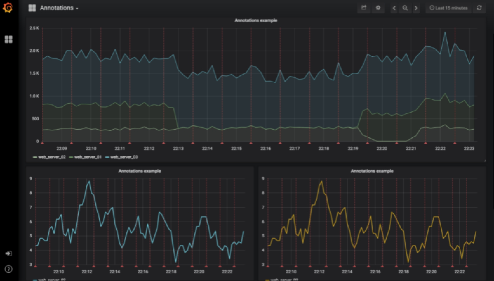

# 485页

https://grafana.com/grafana/download

```shell
这里以安装Grafana 5.2.2-1版本为例进行讲解。
使用如下命令进行安装。

shell# wget https://s3-us-west-2.amazonaws.com/grafana-releases/release/ grafana-5.2.2-1.x86_64.rpm 
    shell# yum localinstall grafana-5.2.2-1.x86_64.rpm 
#CentOS 7启动命令
shell# systemctl daemon-reload
shell# systemctl start grafana-server
shell# systemctl status grafana-server
shell# systemctl enable grafana-server.service
#CentOS 6启动命令
shell# service grafana-server start
shell# /sbin/chkconfig  grafana-server on
```

```shell
shell# grafana-cli plugins install alexanderzobnin-zabbix-app
shell# service grafana-server restart
```


# 486页


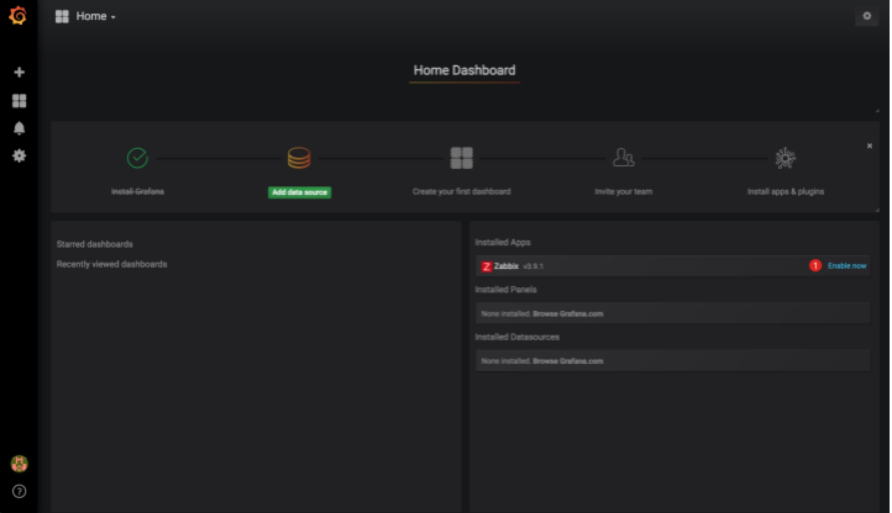

# 487页

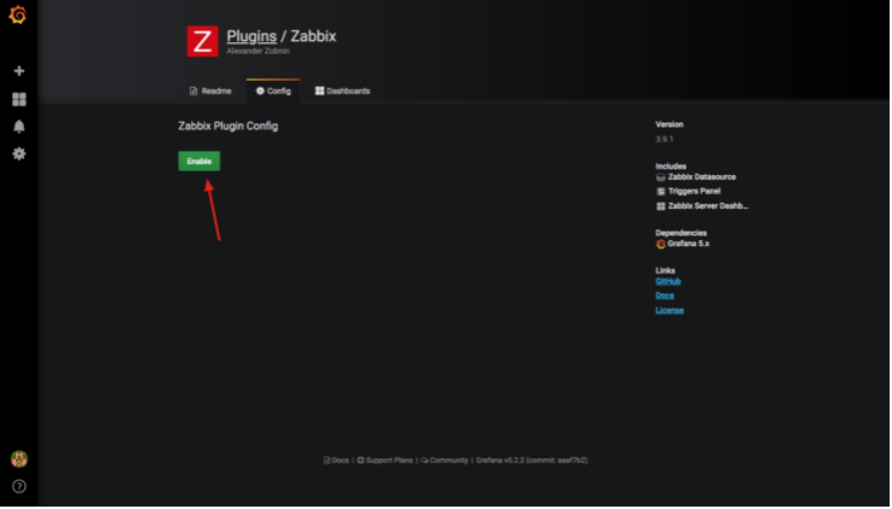


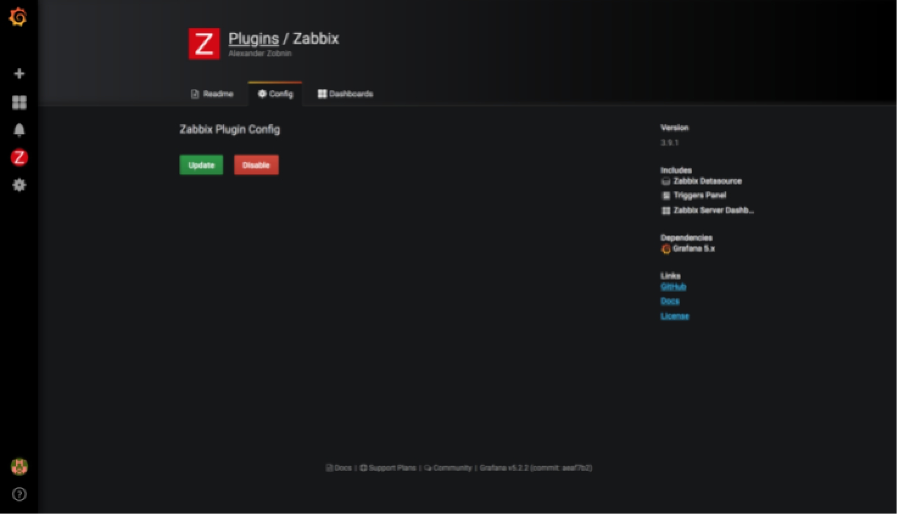

# 488页

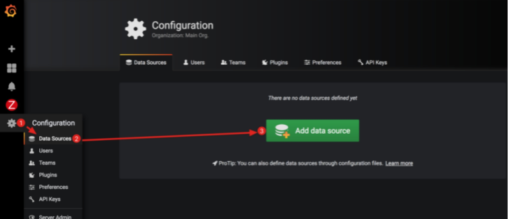

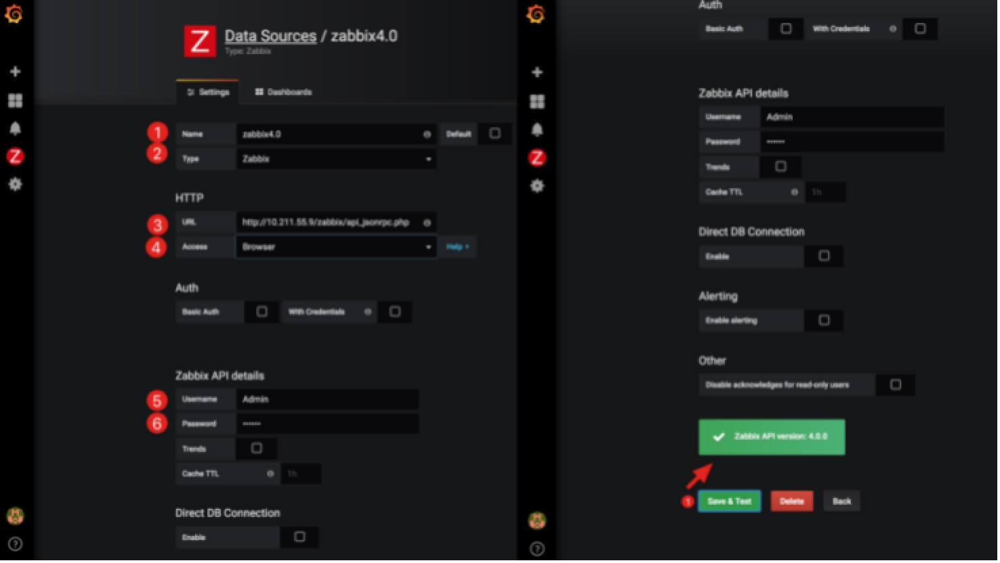

# 489页

表11-1  各配置字段说明

| 字　　段 | 说　　明                                  |
| -------- | ----------------------------------------- |
| Name     | 名称，可以自定义                          |
| Type     | 类型，选择“Zabbix”                        |
| URL      | http://10.211.55.9/zabbix/api_jsonrpc.php |
| Access   | 选择“Brower”                              |
| Username | 用户名为Admin                             |
| Paasword | 密码为zabbix                              |

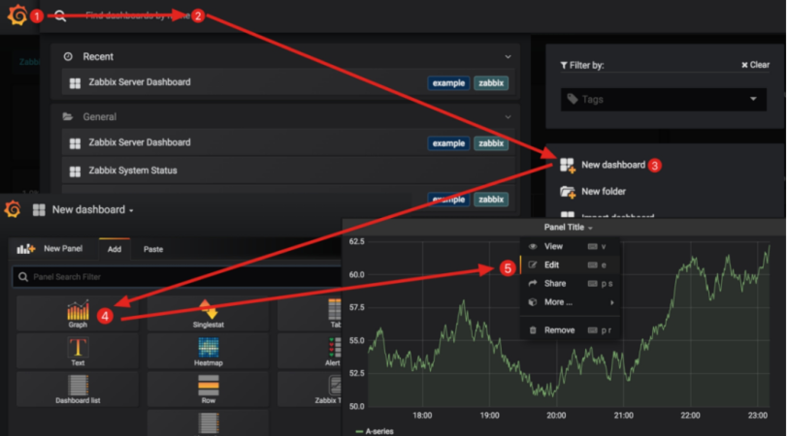

# 490页


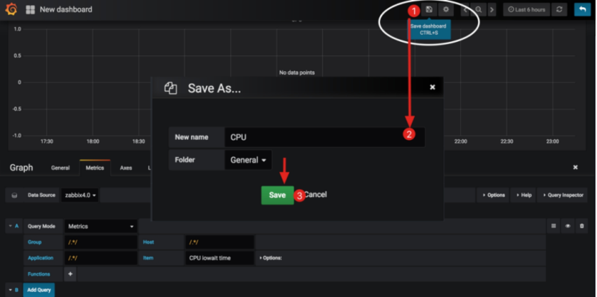

# 491页

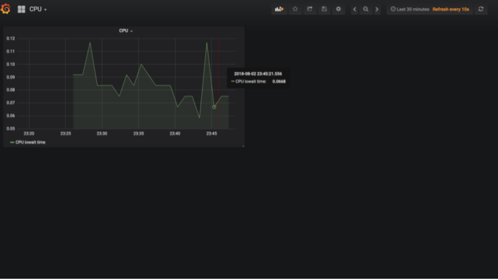

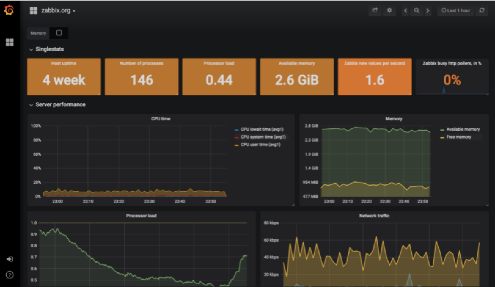

# 492页

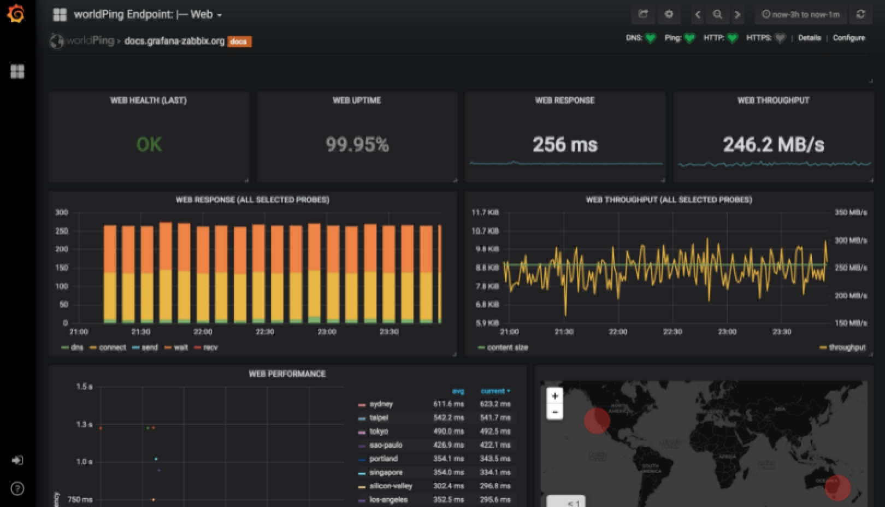

# 493页

```shell
安装命令如下：
shell# cd /usr/share/zabbix
shell# wget https://raw.githubusercontent.com/OneOaaS/graphtrees/master/ graphtree3.0.4.patch
shell# yum install -y patch
shell# patch  -Np0 <graphtree3.0.4.patch
shell# chown -R ${WEB_USER} oneoaas
```

# 493页

https://www.zabbix.com/integrations/chrome_extension

源码地址是：https://github.com/mchugh19/zabbix-vue。

# 495页

[](https:// github.com/gigatec/zabbixnotifier)


# 496页

https://support.zabbix.com/browse/ZBXNEXT-714

到了2018年，在Zabbix 4.0版本中，官方开发支持这个功能，请参考如下地址：

https://support.zabbix.com/browse/ZBXNEXT-4417

# 497页

```shell
shell# vim /etc/zabbix/zabbix_server.conf
### Option: ExportDir
# Directory for real time export of events, history and trends in newline delimited JSON format.
# If set, enables real time export.
#
# Mandatory: no
# Default:
# ExportDir=
ExportDir=/tmp/zbx/json #导出数据存储的路径，使用命令mkdir -p /tmp/zbx/json[？]创建目录

### Option: ExportFileSize
# Maximum size per export file in bytes.
# Only used for rotation if ExportDir is set.
#
# Mandatory: no
# Range: 1M-1G
# Default:
# ExportFileSize=1G #每个进程最大为1GB，超过1G[单位是GB吗？]B后，会将其命名为以.old结尾的日志，然后重新生成新的空文件继续写入数据。对于同一前缀的日志，最多保留2份，即当前日志和以.old结尾的这两份日志。[这句话叙述对吗？]
确保目标路径存在，且权限正确，运行以下命令：

shell# mkdir -p /tmp/zbx/json
shell# chwon zabbix:zabix  /tmp/zbx/json
然后重启Zabbix-Server，运行以下命令：

shell# systemctl restart zabbix-server
```

# 504页

```shell
#Telnet登录到该交换机，执行如下命令
S2>enable
Password: 
S2#configure  terminal
Enter configuration commands, one per line.  End with CNTL/Z.
S2(config)#lldp run
S2(config)#end
S2#write
Building configuration...
[OK]
S2#
在其他交换机上依次配置开启LLDP。在SW2交换机上查看配置文件，命令如下：

S2# show configuration 
省略部分配置文件
lldp run
interface Ethernet0/0
 ip address 192.168.1.42 255.255.255.0
 no mop enabled
!
interface Ethernet0/1
 ip address 10.211.55.42 255.255.255.0
!
interface Ethernet0/2
 ip address 192.168.2.42 255.255.255.0
!
interface Ethernet0/3
 ip address 192.168.3.42 255.255.255.0
!
interface Ethernet1/0
 ip address 192.168.4.42 255.255.255.0
!
interface Ethernet1/1
 ip address 192.168.5.42 255.255.255.0
 no mop enabled
省略部分配置文件
```


# 505页

```shell
S2# show lldp neighbors 
Capability codes:
    (R) Router, (B) Bridge, (T) Telephone, (C) DOCSIS Cable Device
    (W) WLAN Access Point, (P) Repeater, (S) Station, (O) Other
Device ID      Local Intf     Hold-time  Capability    Port ID
R3                  Et1/0          120        R               Et0/0
S4                  Et1/1          120        R               Et0/0
S3                  Et0/3          120        R               Et0/0
S1                  Et0/0          120        R               Et0/0
S5                  Et0/2          120        R               Et0/0

Total entries displayed: 5
```

```shell
shell# snmpwalk -v 2c -c public 10.211.55.42 1.0.8802.1.1.2.1.3.7.1.3
iso.0.8802.1.1.2.1.3.7.1.3.1 = STRING: "Et0/0" #邻接S1[正确的，11.7.3节
S1   Et0/0   120   R    Et0/0
][在图中没发现S1]的Et0/0
iso.0.8802.1.1.2.1.3.7.1.3.2 = STRING: "Et0/1"
iso.0.8802.1.1.2.1.3.7.1.3.3 = STRING: "Et0/2" #邻接S5的Et0/0
iso.0.8802.1.1.2.1.3.7.1.3.4 = STRING: "Et0/3" #邻接S3的Et0/0
iso.0.8802.1.1.2.1.3.7.1.3.5 = STRING: "Et1/0" #邻接R3的Et0/0
iso.0.8802.1.1.2.1.3.7.1.3.6 = STRING: "Et1/1" #邻接S4的Et0/0
iso.0.8802.1.1.2.1.3.7.1.3.7 = STRING: "Et1/2" #无邻居
iso.0.8802.1.1.2.1.3.7.1.3.8 = STRING: "Et1/3" #无邻居
```

```shell
shell# snmpwalk -v 2c -c public 10.211.55.42 1.0.8802.1.1.2.1.4.1.1.7
iso.0.8802.1.1.2.1.4.1.1.7.0.1.4 = STRING: "Et0/0"
iso.0.8802.1.1.2.1.4.1.1.7.0.3.2 = STRING: "Et0/0"
iso.0.8802.1.1.2.1.4.1.1.7.0.4.1 = STRING: "Et0/0"
iso.0.8802.1.1.2.1.4.1.1.7.0.5.3 = STRING: "Et0/0"
iso.0.8802.1.1.2.1.4.1.1.7.0.6.5 = STRING: "Et0/0"
```

```shell
shell# snmpwalk -v 2c -c public 10.211.55.42 1.0.8802.1.1.2.1.4.1.1.9
iso.0.8802.1.1.2.1.4.1.1.9.0.1.4 = STRING: "S1"
iso.0.8802.1.1.2.1.4.1.1.9.0.3.2 = STRING: "S5"
iso.0.8802.1.1.2.1.4.1.1.9.0.4.1 = STRING: "S3"
iso.0.8802.1.1.2.1.4.1.1.9.0.5.3 = STRING: "R3"
iso.0.8802.1.1.2.1.4.1.1.9.0.6.5 = STRING: "S4"
```

# 506页

表11-3 SNMP LLDP OID

| OID                       | 节 点 名 称             | 数 据 类 型               | 含　　义               |
| ------------------------- | ----------------------- | ------------------------- | ---------------------- |
| 1.0.8802.1.1.2.1.4.1.1.4  | lldpRemChassisIdSubtype | LldpChassisIdSubtype      | 远端设备ID子类型       |
| 1.0.8802.1.1.2.1.4.1.1.5  | lldpRemChassisId        | LldpChassisId             | 远端设备ID             |
| 1.0.8802.1.1.2.1.4.1.1.6  | lldpRemPortIdSubtype    | LldpPortIdSubtype         | 远端设备的端口ID子类型 |
| 1.0.8802.1.1.2.1.4.1.1.7  | lldpRemPortId           | LldpPortId                | 远端设备的端口索引ID   |
| 1.0.8802.1.1.2.1.4.1.1.8  | lldpRemPortDesc         | SnmpAdminString           | 远端设备的端口描述     |
| 1.0.8802.1.1.2.1.4.1.1.9  | lldpRemSysName          | SnmpAdminString           | 远端设备名称           |
| 1.0.8802.1.1.2.1.4.1.1.10 | lldpRemSysDesc          | SnmpAdminString           | 远端设备类型描述       |
| 1.0.8802.1.1.2.1.4.1.1.11 | lldpRemSysCapSupported  | LldpSystemCapabilitiesMap | 远端设备是否支持LLDP   |
| 1.0.8802.1.1.2.1.4.1.1.12 | lldpRemSysCapEnabled    | LldpSystemCapabilitiesMap | 远端设备是否开启LLDP   |

# 507页

https://share.zabbix.com/network_devices/l2-discovery-module-for-lldp

为方便读者获取，笔者将模板放到GitHub上，地址如下：

https://github.com/zabbix-book/snmp_lldp

为Zabbix-Server增加支持SNMP LLDP的功能，配置如下：

````shell
shell# mkdir -p /etc/zabbix/modules
shell# wget https://raw.githubusercontent.com/zabbix-book/snmp_lldp/ master/modules/zabbix4.0/lldp_get.so
shell# vim /etc/zabbix/zabbix_server.conf
####### LOADABLE MODULES #######
LoadModulePath=/etc/zabbix/modules
LoadModule=lldp_get.so
shell# systemctl restart zabbix-server
````

从Zabbix-Web管理界面导入模板，地址如下：

https://github.com/zabbix-book/snmp_lldp/blob/master/data/zabbix3.0/templates/zbx_export_templates.xml